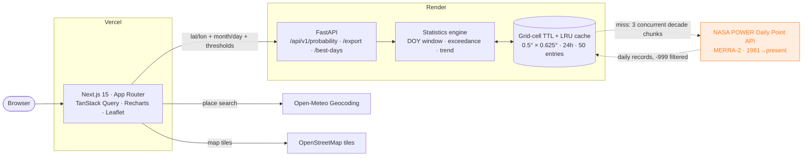

<div align="center">

# orbitWx

### Will it rain on your parade?

**30 years of NASA Earth observation data, turned into the odds of bad weather at any place, on any calendar date.**

[](https://nextjs.org)
[](https://www.typescriptlang.org)
[](https://fastapi.tiangolo.com)
[](https://power.larc.nasa.gov/)
[](https://vercel.com)
[](https://render.com)
[](#license)

### [**→ Live app**](https://orbitwx.vercel.app)

**NASA Space Apps Challenge 2025** · [Will It Rain On My Parade?](https://www.spaceappschallenge.org/2025/challenges/will-it-rain-on-my-parade/) · Team Coders

</div>

---

## The idea

Weather apps forecast the next ten days. But people book weddings, plan hikes,
schedule festivals and pick race dates **months or years** ahead — long past the
horizon where any forecast exists.

orbitWx answers the question that *is* answerable at that range:

> **Historically, what are the odds of very hot / very cold / very windy / very
> wet / very uncomfortable conditions at this location on this calendar date?**

It samples every matching day across 30 years of NASA POWER daily records and
reports empirical probabilities, the full distribution, where your threshold sits
in the local climate, and how the odds have shifted decade over decade.

> [!IMPORTANT]
> **orbitWx is climatology, not a forecast.** It shows historical likelihoods
> from NASA Earth observation data — not a prediction for a specific upcoming
> day. This distinction is deliberate and appears throughout the UI, the API
> responses and the exports.

---

## Screenshots

> Add captures to `docs/screenshots/` and link them here.

| Dashboard | Per-variable detail | Smart Date Finder |
|---|---|---|
| _`docs/screenshots/dashboard.png`_ | _`docs/screenshots/detail.png`_ | _`docs/screenshots/finder.png`_ |

---

## Architecture



**Why the cache is keyed on the grid cell:** POWER serves a 0.5° × 0.625° grid,
so every coordinate inside a city resolves to the same cell. Rounding before
caching means the second search in Ahmedabad costs one dictionary lookup instead
of a 30-year fetch.

---

## Methodology

Full write-up lives at [`/methodology`](frontend/src/app/methodology/page.tsx) in
the running app. In brief:

**1 · Day-of-year window sampling.** A single calendar date gives only 30
observations. orbitWx widens the target into a **±7-day window** (adjustable
1–15) across every year:

```
15 days per year × 30 years = up to 450 observations
```

The window is built with real date arithmetic per year, so it wraps correctly
across the year boundary (a Jan 3 target reaches into the previous December), and
Feb 29 falls back to Feb 28 in non-leap years.

**2 · Empirical exceedance probability.** No distribution is fitted — the
probability is the observed frequency:

```
P(condition) = count(days breaching threshold) / count(valid days)
```

| Condition | Variable | Default threshold |
|---|---|---|
| Very Hot | `T2M_MAX` | > 35 °C |
| Very Cold | `T2M_MIN` | < 5 °C |
| Very Windy | `WS10M` | > 10 m/s |
| Very Wet | `PRECTOTCORR` | > 10 mm/day |
| Very Uncomfortable | Heat index | > 40 °C |

Rainfall is additionally reported at three fixed tiers — ≥ 1 mm, ≥ 5 mm and
≥ 10 mm — regardless of your threshold, because *"will it rain on my parade"* is
really a question about any rain at all. Each condition also reports the
**percentile** its threshold occupies locally, so you know whether you picked a
genuinely extreme bar for that place.

**3 · Heat index.** The NOAA/Rothfusz regression, the same polynomial the US
National Weather Service publishes, valid at or above 80 °F; below that the
dry-bulb temperature is reported unchanged.

**4 · Climate trend.** For each year, the exceedance fraction inside the window
is computed and regressed against year (`numpy.polyfit`, degree 1). The response
carries the slope per decade *and* a plain-language first-decade vs last-decade
comparison, e.g. *"Heavy-rain odds on this date rose from 18% (1996–2005) to 27%
(2016–2025)."*

**5 · Provenance travels with the answer.** Every response includes the grid cell
used, years covered, sample size, missing-day counts, units and the exact POWER
request URL.

---

## API reference

Base URL: `https://orbitwx-api.onrender.com` · interactive docs at `/docs`

| Method | Endpoint | Description |
|---|---|---|
| `GET` | `/api/v1/probability` | Five condition probabilities with distributions, percentiles and trends, plus rain tiers and provenance |
| `GET` | `/api/v1/export` | The raw sample rows behind a calculation, as CSV or JSON with source attribution |
| `GET` | `/api/v1/best-days` | Smart Date Finder — every day of a month ranked by combined risk |
| `GET` | `/health` | Liveness + cache statistics |

### Parameters

| Param | Type | Default | Notes |
|---|---|---|---|
| `lat` | float, −90…90 | — | Required |
| `lon` | float, −180…180 | — | Required |
| `month` | int, 1–12 | — | Required |
| `day` | int, 1–31 | — | Required except on `/best-days`; impossible dates return `422` |
| `window` | int, 1–15 | `7` | Day-of-year half-window |
| `hot_threshold` | float °C | `35` | |
| `cold_threshold` | float °C | `5` | |
| `wind_threshold` | float m/s | `10` | |
| `wet_threshold` | float mm/day | `10` | |
| `comfort_threshold` | float °C | `40` | Heat index |
| `format` | `csv` \| `json` | `csv` | `/api/v1/export` only |

```bash
# Ahmedabad, mid-October
curl "http://localhost:8000/api/v1/probability?lat=23.03&lon=72.58&month=10&day=15"
```

`/api/v1/*` is rate limited to **30 requests/minute/IP**. `/health` is exempt so
uptime pings can keep the free-tier instance warm.

---

## Local setup

### Backend

```bash
cd backend
python3 -m venv .venv && source .venv/bin/activate
pip install -r requirements.txt
cp .env.example .env
uvicorn app.main:app --reload --port 8000
```

Docs at <http://localhost:8000/docs>. Run the tests (httpx is mocked — the suite
never touches the live NASA API):

```bash
pytest
```

### Frontend

```bash
cd frontend
npm install
cp .env.example .env.local     # NEXT_PUBLIC_API_URL=http://localhost:8000
npm run dev
```

App at <http://localhost:3000>. Before committing:

```bash
npx tsc --noEmit && npm run lint && npm run build
```

**Requirements:** Python 3.11+ (3.13 recommended — 3.14 has no prebuilt
`pydantic-core` wheel yet) and Node 18+.

---

## Deployment

### Backend → Render

`render.yaml` at the repo root is a ready blueprint: **New → Blueprint**, point
it at this repo, Apply. (Render looks for `render.yaml` at the root by default;
`rootDir: backend` inside it points the build at the API package.) `ALLOWED_ORIGINS` is already set to `https://orbitwx.vercel.app`, and the
service is named `orbitwx-api` so it lands on
`https://orbitwx-api.onrender.com` — the URL the deployed frontend already
points at. Nothing else to configure.

The free tier sleeps after 15 minutes and takes ~30–50 s to wake — the UI shows a
*"Waking the satellite uplink…"* state when a request runs long. To avoid it
entirely, register a [cron-job.org](https://cron-job.org) job hitting `/health`
every 10 minutes.

### Frontend → Vercel

Already deployed at **[orbitwx.vercel.app](https://orbitwx.vercel.app)**, with
the GitHub repo connected for auto-deploys on push to `main` (root directory
`frontend`).

To reproduce from scratch: import the repo, set the root directory to
`frontend`, and add:

```
NEXT_PUBLIC_API_URL=https://orbitwx-api.onrender.com
NEXT_PUBLIC_SITE_URL=https://orbitwx.vercel.app
```

---

## Project layout

```
orbitwx/
├── backend/
│   ├── app/
│   │   ├── main.py               # FastAPI app, CORS, error handling
│   │   ├── config.py             # pydantic-settings
│   │   ├── routers/              # probability · export · health
│   │   ├── services/
│   │   │   ├── nasa_power.py     # POWER client, chunking, grid-cell cache
│   │   │   ├── statistics.py     # the probability engine
│   │   │   └── comfort.py        # NOAA heat index
│   │   ├── models/schemas.py     # Pydantic v2 — the API contract
│   │   └── core/                 # cache · params · limiter
│   └── tests/                    # 58 pytest cases, no live API calls
├── frontend/
│   ├── src/app/                  # dashboard · methodology · about
│   ├── src/components/           # dashboard, charts, shadcn-style primitives
│   └── src/lib/                  # typed API client, types, geocoding, format
└── render.yaml                   # Render blueprint (must stay at the root)
```

Design decisions worth knowing:

- **No pandas.** numpy alone keeps the Render free-tier image small.
- **No database, no auth, no Docker.** This is intentionally a stateless
  two-service app; the only state is a bounded in-memory cache.
- **TypeScript strict, zero `any`.** `frontend/src/lib/types.ts` mirrors the
  Pydantic schemas one-for-one.

---

## Data attribution

**Data obtained from the NASA Langley Research Center (LaRC) POWER Project**
funded through the NASA Earth Science/Applied Science Program.

orbitWx is an independent project and is not endorsed by NASA. Place search is
provided by [Open-Meteo](https://open-meteo.com/); map tiles by
[OpenStreetMap](https://www.openstreetmap.org/copyright) contributors.

---

## Team

**Team Coders** — [Het Patel](https://buildbyhet.me) ([@Het161](https://github.com/Het161))

Built for the [NASA Space Apps Challenge 2025](https://www.spaceappschallenge.org/2025/challenges/will-it-rain-on-my-parade/).

## License

MIT — see [LICENSE](LICENSE).
